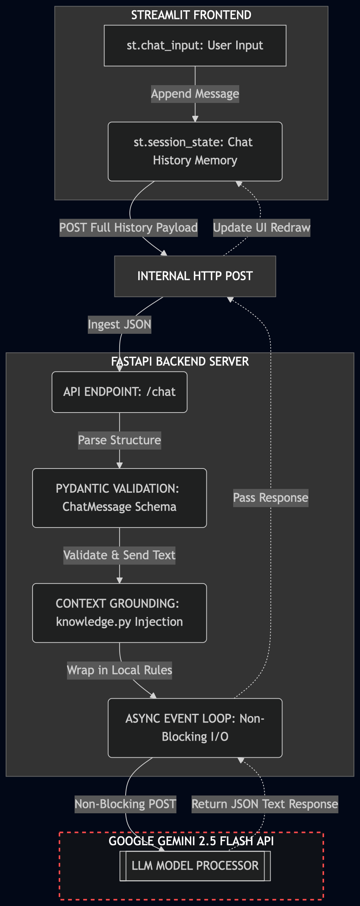

# LineMaker AI: Sports Betting Chatbot

It's a production-ready customer-support chat system designed for a sports betting platform. The architecture is explicitly split into an asynchronous, type-validated backend API, and a reactive, hardcoded frontend user interface.


## System Architecture

The app implements a decoupled, event-driven pattern to completely separate user interface tracking from data validation and AI context pipelines.



1. **Streamlit Frontend:** Serves as a stateless rendering layout. It captures inputs, appends messages to an ephemeral browser-side state array, and ships payloads across an internal HTTP request pipeline.

2. **FastAPI Backend:** Serves as the security gate and processing core. It ingests the payload, evaluates structures via Pydantic model contracts, wraps queries with an enterprise domain knowledge base, and processes async calls to the downstream LLM.


## Technical Core Highlights

* **Strict Data Validation:** Utilizes Pydantic structures to explicitly enforce typing schemas on incoming JSON request bodies. This prevents generic Python KeyErrors or bad input mutations from executing in the runtime memory loop.

* **Context Grounding (RAG-lite):** Replaces expensive fine-tuning or vector indexing loops for localized platform configurations by intercepting requests and injecting dynamic context boundaries inline before upstream API handshakes.

* **Asynchronous Networking:** Uses native async def routing. Network overhead incurred from third-party generative endpoints pauses execution cleanly via an event loop, allowing the API gateway to stay open for concurrent requests.

* **Enforced UI Design Stack:** Configured via `.streamlit/config.toml` to completely override automated OS system appearance switching. This blocks unexpected light-mode triggers.


## Tech Stack

* **Language:** Python 3.11+

* **Backend Framework:** FastAPI (Asynchronous Server Gateway Interface)

* **Frontend Controller:** Streamlit (Reactive redraw loop)

* **Validation Engine:** Pydantic v2

* **Model Pipeline:** Google GenAI SDK (`gemini-2.5-flash`)


## Getting Started

1. **Install Dependencies:**
   ```bash
   pip install fastapi uvicorn google-genai streamlit python-dotenv pydantic

```

2. **Configure Environment:**
Create a `.env` file in the root directory:
```env
GEMINI_API_KEY="your_api_key_here"

```


3. **Boot Backend Server:**
```bash
python main.py

```


4. **Boot Frontend UI:**
```bash
streamlit run app.py

```
